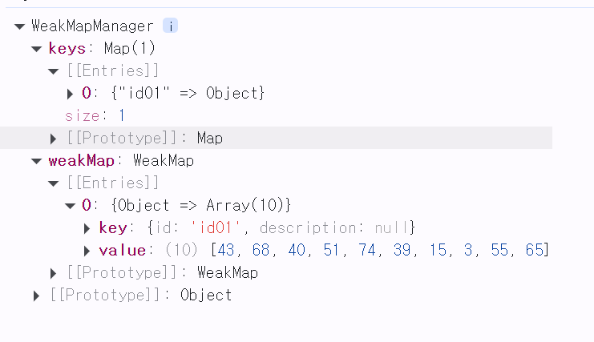

# WeakMap사용하기

<aside>

## chapter_4

💡
1. WeakMap을 선언한다
2. Key를 생성한다
    1. Key는 클로저 함수를 통해 하나의 인스턴스를 유지한다.
3. 데이터를 key와 data로 삽입한다
</aside>
---

```jsx
import { WeakMapManager as WeakMapManager } from "./WeakMapManager.js"; // keyManager 모듈을 import합니다.
const wmm = new WeakMapManager(); // 인스턴스를 하나만 유지

let data_store = [1, 2, 3, 4, 5, 6, 7, 8, 9, 10]; // 데이터 저장소를 초기화합니다.

// 데이터를 랜덤으로 변경합니다.
let data = data_store.map((item) => Math.floor(Math.random() * 100)); 


wmm.add('id01', data); // 키를 사용하여 데이터를 저장합니다.

console.log(wmm); // 추가된 wmm 상태를 출력합니다.
```

WeakMap을 const로 선언한 뒤 내부에 데이터를 삽입(store.set)을 통해 데이터를 저장하여 하나의 데이터 저장소를 통해 데이터를 관리 메모리 누수를 방지한다.

WeakMap은 전역변수 영역에 존재하여도 js의 GC의 관리 대상이 되므로 사용하지 않은 데이터들은 자동으로 삭제가 된다. 

항상 Key, Value형태로 데이터가 저장되어야 한다. 

Key는 객체여야만 한다. (문자열도 하나의 객체이므로 가능) 단, 같은 이름의 key를 생성해도 새로 생성된 객체라면 기존의 객체와 다르므로 같은 이름의 객체가 중복되어 생성되므로 key를 전역적으로 선언해서 관리해야 한다.

그러면 작업시 key를 생성하기 위해 전역변수를 따로 관리하는 불편함이 생겨 해당 key들도 한곳에서 관리가 되며, 인스턴스가 유지되는 형태가 필요하다. 그래서 keyMager의 getKey를 통해 key를 생성하여 입력하여 key관리와 중복되는 key들도 하나의 key로 관리되겠끔 처리해야 한다.

```jsx

class WeakMapManager {
    constructor() {
        this.keys = new Map();
        this.weakMap = new WeakMap();
    }

    // id로 키를 설정하고, 없으면 생성하는 메서드
    setKey(id, desc = null) {
        let keyObj = this.keys.get(id);

        if (!keyObj) {
            keyObj = { id: id, description: desc };
            this.keys.set(id, keyObj);  // Map에 새로 추가
        }

        return keyObj;
    }

    // id로 값을 가져오는 메서드
    getKey(id) {
        let keyObj = this.keys.get(id);

        if (keyObj) {
            return keyObj;
        } else {
            console.log("Key not found");
            return this.setKey(id);  // 키가 없을 경우 키 생성 반환
        }
    }

    // id로 값을 추가하는 메서드
    add(id, value) {
        const keyObj = this.getKey(id);  // setKey 호출해서 id로 키를 얻음
        this.weakMap.set(keyObj, value);  // WeakMap에 값을 추가
    }

    // description 수정
    updateDesc(id, newDesc) {
        let keyObj = this.keys.get(id);
        if (keyObj) {
            keyObj.description = newDesc;  // 기존 객체의 desc 값만 수정
        } else {
            console.log("Key not found");
        }
    }

    // 키 삭제
    deleteKey(id) {
        const keyObj = this.keys.get(id);
        if (keyObj) {
            this.keys.delete(id);  // Map에서 삭제
            this.weakMap.delete(keyObj);  // WeakMap에서 삭제
        }
    }
}

export { WeakMapManager };

```



---